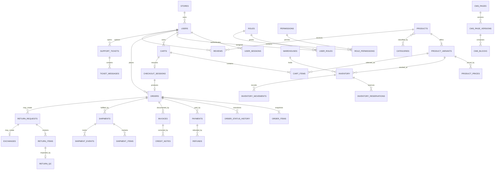

# Iced_out Database Architecture

> MySQL data model for the Iced_out storefront, customer account, warehouse workflows, and `/admin` console. This document is derived from [`product-blueprint.md`](./product-blueprint.md) and [`frontend.md`](./frontend.md); when a commerce rule is repeated here, the database constraint and transaction described here are the persistence contract for that rule.

**Version:** `1.0`  
**Status:** `Architecture baseline`  
**Database:** MySQL `8.4 LTS` recommended, InnoDB, `utf8mb4_0900_ai_ci`  
**Baseline schema:** `121` physical tables

**Approved scope:** [`product-blueprint.md`](./product-blueprint.md) and [`frontend.md`](./frontend.md) require a verified customer before bag, checkout, payment, or order creation. Public catalog destinations are New Drop, Men, Women, Collections, and Sale, with About and Contact content pages; categories remain internal catalog classification.

---

## 1. Scope and decisions

The schema supports the complete Iced_out lifecycle:

- customer and staff identity, separate session audiences, consent, account deletion, and RBAC;
- apparel products with size × colour × material variants, media, scheduled pricing, categories, collections, search, and recommendations;
- warehouse-level stock, reservations, an immutable movement ledger, transfers, counts, pick/pack tasks, and return QC;
- authenticated customer carts and checkout, guest-local wishlist synchronization, coupons, abandoned-cart recovery, wishlist alerts, and campaigns;
- immutable order snapshots, GST tax, invoices, credit notes, payments, settlement reconciliation, refunds, and store credit;
- forward, reverse, exchange, and RTO shipping, manifests, courier events, NDR handling, returns, and exchanges;
- verified reviews, notifications, support tickets, typed CMS content, analytics events, and five-minute dashboard rollups;
- idempotency, raw webhook capture, a transactional outbox, a MySQL queue fallback, audit trails, migrations, and restore operations.

The primary database is the source of truth for money, stock, orders, permissions, and workflow state. Redis may cache catalog responses, sessions, carts, rate limits, locks, and jobs, but cache loss must never lose a confirmed business fact. Search indexes and analytics tools are projections and are never consulted to authorize a purchase.

### 1.1 Deliberate consolidations

The blueprint expects ≈120 tables. This design lands at 121 without creating a separate table for every presentation type:

- `media_assets` + `media_links` replace separate product, review, return, ticket, and CMS attachment stores while retaining explicit foreign keys.
- `sizes`, `colors`, and `materials` are first-class apparel axes rather than a generic EAV attribute model. This preserves the required `(product_id, size_id, color_id, material_id)` uniqueness and fast variant lookup; a new sellable axis requires an explicit migration.
- Each customer has one canonical wishlist, so `wishlist_items.user_id` is the owner and a redundant `wishlists` header is unnecessary.
- `cms_pages.type` represents Home, About, Contact, policy, and standard pages. `cms_blocks.type` represents banners, hero blocks, destination tiles, product/collection rails, brand/contact content, promo strips, and announcements.
- `warehouse_tasks.type` represents pick, pack, dispatch-preparation, and return-QC work; exact expected and scanned lines remain normalized in `warehouse_task_items`.
- `notification_preferences` also stores endpoint suppression caused by a bounce, complaint, or unsubscribe.
- `payment_attempts.operation_type` records payment, verification, capture, refund, and reconciliation calls as one append-only provider interaction ledger.
- Order address, contact, item description, price, discount, tax, and total values are frozen snapshots. JSON is used only for immutable structured snapshots or provider payloads whose shape legitimately varies; relational columns remain authoritative for querying and reconciliation.

---

## 2. Storage and naming standards

| Concern | Standard |
|---|---|
| Tables and columns | Plural `snake_case` tables; singular `<entity>_id` foreign keys |
| Primary keys | `id BIGINT UNSIGNED AUTO_INCREMENT` |
| Public identifiers | `public_id BINARY(16)` containing an application-generated UUIDv7, unique; sequential `id` is never exposed as an authorization boundary |
| Engine and charset | InnoDB; `utf8mb4`; `utf8mb4_0900_ai_ci` unless a case-sensitive key needs an explicit binary collation |
| Time | `DATETIME(6)` in UTC; local dates use `DATE`; the store timezone is `Asia/Kolkata` by default |
| Money | `DECIMAL(12,2)` plus `currency CHAR(3)`; no floating point and no client-supplied final amount |
| Quantity | `INT UNSIGNED`; signed ledger deltas use `INT` |
| Weight and dimensions | Grams and millimetres using integer columns; no locale-dependent units in storage |
| Boolean | `TINYINT(1)` named `is_*`, with `CHECK (value IN (0,1))` where useful |
| Status | `VARCHAR(32)` checked against version-controlled constants; never MySQL `ENUM` and never an undocumented magic string |
| IP addresses | `VARBINARY(16)` using `INET6_ATON`/`INET6_NTOA` at the repository boundary |
| Secrets and tokens | Store only SHA-256/HMAC hashes in `BINARY(32)`; raw refresh, OTP, reset, API, tracking, preview, and restore tokens are never persisted |
| JSON | Native `JSON`, schema-validated by the service and by `JSON_SCHEMA_VALID` checks for critical shapes where practical |
| Mutable timestamps | `created_at`, `updated_at`; soft-deletable records also have `deleted_at` |
| Ledgers/history | `created_at` only; no `updated_at` or `deleted_at` and no update/delete permission for the application role |

All business-owned tables carry `store_id` unless they are global infrastructure or children whose store can be reached unambiguously through a required parent. Iced_out ships with one store row, but explicit store ownership enforces the store/resource scopes required by the admin RBAC contract.

### 2.1 Data classification

| Class | Examples | Handling |
|---|---|---|
| Public | published product copy, public review, CMS content | Cacheable only after publication rules pass |
| Customer confidential | email, mobile, addresses, order history | Least-privilege API projection; never placed in URLs, analytics, or browser logs |
| Restricted | payment references, bank/UPI refund destination, staff scopes | Masked by default; explicit permission and audit event required to reveal |
| Secret | passwords, refresh tokens, API keys, gateway secrets | Passwords use Argon2id; tokens/keys are hashed; provider secrets stay in a secret manager/environment, not `store_settings` |
| Statutory/immutable | invoices, credit notes, ledger rows, order snapshots | Retained under the approved finance policy; corrected by compensating records, never edits |

---

## 3. Relationship overview



This diagram shows ownership, not every foreign key. The data dictionary below is authoritative.

---

## 4. Table catalogue and data dictionary

Notation used below:

- `→ table` means a foreign key.
- `[UQ ...]` is a unique key, `[IX ...]` is a non-unique index, and `[CK ...]` is a check constraint.
- Common `id`, `public_id`, `store_id`, and timestamp columns are omitted from a row when their presence follows the standards above.
- `RESTRICT` is the default delete action for commerce facts; `CASCADE` is used only for pure join/configuration children; actors may use `SET NULL` when staff removal must not erase history.

### 4.1 Identity, customer data, RBAC, and audit — 14 tables

| # | Table | Purpose and key columns | Required keys and constraints |
|---:|---|---|---|
| 1 | `users` | Customer and staff identity: `type`, `status`, names, email/normalized email, mobile/E.164 mobile, password hash, verification times, MFA type/encrypted secret/recovery-code hashes/enabled time, `preferences_json`, failed-login/lockout, return-risk flag, deletion/anonymization and last-login times | `[UQ store_id,email_normalized]`, `[UQ store_id,mobile_e164]`; email/mobile may be null after anonymization; status and type checks; production `ADMIN` requires active MFA |
| 2 | `user_addresses` | Named customer addresses: `user_id`, recipient, mobile, lines, landmark, city, state code, country code, postal code, `address_type`, `is_default`, validation result | `user_id → users`; `[IX user_id,is_default,deleted_at]`; only one default per address type is enforced transactionally |
| 3 | `user_identities` | Google/Apple links: `user_id`, `provider`, `provider_subject`, provider email, `linked_at`, `last_used_at` | `[UQ provider,provider_subject]`; `[UQ user_id,provider]`; `user_id → users` |
| 4 | `user_sessions` | Separate customer/staff refresh sessions: `user_id`, `audience`, `token_hash`, `family_id`, `parent_session_id`, device/IP/user-agent, expiry, rotation, revocation and reuse-detection fields | `[UQ token_hash]`, `[IX user_id,audience,revoked_at,expires_at]`, `[IX family_id]`; `parent_session_id → user_sessions` |
| 5 | `auth_challenges` | Hashed OTP, email verification, password reset, COD confirmation, and re-auth challenges: `user_id`, `purpose`, `identifier_hash`, `token_hash`, `attempt_count`, `max_attempts`, `expires_at`, `consumed_at` | `[UQ token_hash]`, `[IX identifier_hash,purpose,created_at]`, `[IX expires_at,consumed_at]`; attempts cannot exceed maximum |
| 6 | `login_attempts` | Append-only success/failure record with identifier hash, optional `user_id`, audience, IP, user-agent, result, reason, CAPTCHA and lockout signals | `[IX identifier_hash,created_at]`, `[IX ip_address,created_at]`, `[IX user_id,created_at]`; no raw password or raw unknown identifier |
| 7 | `user_consents` | Versioned consent evidence: optional `user_id`, guest contact hash, `consent_type`, policy/version, granted/revoked, source, IP, locale, captured time | `[IX user_id,consent_type,captured_at]`; append a new decision rather than overwriting old evidence |
| 8 | `saved_payment_methods` | Gateway token references only: `user_id`, provider, provider customer/token reference, method type, network, last four, expiry month/year, label, default flag, revoked time | `[UQ provider,provider_token_reference]`; `[IX user_id,is_default,revoked_at]`; no PAN/CVV |
| 9 | `roles` | Role bundles such as `CUSTOMER`, `SUPPORT`, `WAREHOUSE`, `MANAGER`, `ADMIN`: code, name, description, `is_system` | `[UQ store_id,code]`; system roles cannot be deleted |
| 10 | `permissions` | Stable permission codes such as `orders.view` and `refunds.approve`, domain, description, sensitivity | `[UQ code]`; global seed data |
| 11 | `role_permissions` | Permission membership: `role_id`, `permission_id`, granting actor/time | `[PK/UQ role_id,permission_id]`; both FKs `CASCADE` only while the role is not in use |
| 12 | `user_roles` | User-to-role assignment plus scope: `user_id`, `role_id`, `scope_store_id`, optional `warehouse_id`, generated `warehouse_scope_key = COALESCE(warehouse_id,0)`, `scope_json`, validity window, granting actor | `[UQ user_id,role_id,scope_store_id,warehouse_scope_key]`; `[IX user_id,valid_from,valid_until]`; staff cannot grant a permission they do not possess |
| 13 | `audit_logs` | Immutable security/regulatory evidence: actor/session, permission used, request ID, action, entity type/public ID, reason, before/after JSON, IP, classification | `[UQ request_id,action,entity_type,entity_public_id]` where applicable; `[IX actor_user_id,created_at]`, `[IX entity_type,entity_public_id,created_at]` |
| 14 | `activity_logs` | Immutable operational/customer-visible activity: actor/source, entity type/public ID, event code, summary, metadata | `[IX entity_type,entity_public_id,created_at]`, `[IX actor_user_id,created_at]`; destructive admin changes also create an `audit_logs` row |

### 4.2 Catalog, media, discovery, and recommendations — 22 tables

| # | Table | Purpose and key columns | Required keys and constraints |
|---:|---|---|---|
| 15 | `brands` | Brand identity, slug, description, logo media reference, active flag | `[UQ store_id,slug]`; soft delete |
| 16 | `categories` | Recursive category tree: `parent_id`, name, slug, description, sort order, publication/SEO fields | `parent_id → categories`; `[UQ store_id,slug]`, `[IX parent_id,sort_order]`; cycles rejected by service |
| 17 | `products` | Draft/published/archived product: brand, name, slug, descriptions, fabric/care, status, featured/new flags, tax class, size chart, return policy, weight/dimensions, SEO/OG, publish/archive times | `[UQ store_id,slug]`; `[IX store_id,status,published_at]`; required publish fields checked by publish service; ordered products are never hard-deleted |
| 18 | `product_categories` | Product/category membership and primary flag | `[UQ product_id,category_id]`; `[IX category_id,is_primary,sort_order]`; pure join rows cascade with product/category drafts |
| 19 | `collections` | Merchandised drops/collections: slug, name, description, status, schedule, SEO | `[UQ store_id,slug]`, `[IX status,starts_at,ends_at]` |
| 20 | `collection_products` | Ordered collection membership: collection, product, position, active window | `[UQ collection_id,product_id]`, `[IX collection_id,position]` |
| 21 | `tags` | Normalized product tags: code, label | `[UQ store_id,code]` |
| 22 | `product_tags` | Product/tag membership | `[UQ product_id,tag_id]`; pure join |
| 23 | `sizes` | Size vocabulary and ordering: code, label, system (`APPAREL`, `FOOTWEAR`, `ONE_SIZE`), sort order | `[UQ store_id,system,code]` |
| 24 | `colors` | Colour vocabulary: code, name, hex, swatch media, sort order | `[UQ store_id,code]`; hex format check |
| 25 | `materials` | Material vocabulary: code, name, description | `[UQ store_id,code]` |
| 26 | `size_charts` | Versioned chart definition: name, category, unit, version, ordered `measurements_json`, model/fit notes, active flag | `[UQ store_id,name,version]`; published products reference an immutable version |
| 27 | `product_variants` | Exact sellable SKU: product, size, colour, material, SKU, barcode, status, per-order cap, weight/dimension overrides | `[UQ store_id,sku]`, `[UQ store_id,barcode]`, `[UQ product_id,size_id,color_id,material_id]`; all three axes use seeded fallback values rather than nullable uniqueness |
| 28 | `media_assets` | Storage object metadata: object key, original name, MIME, bytes, width/height/duration, checksum, processing status, derivative manifest, upload actor | `[UQ store_id,object_key]`, `[UQ store_id,checksum,object_key]`; assets are quarantined until validated and EXIF-stripped |
| 29 | `media_links` | Ordered asset ownership with explicit nullable FKs for exactly one of product, review, return item, ticket message, or CMS block; optional colour/variant qualifier, role, alt text, sort order | `[CK exactly one owner FK is non-null]`; `[IX product_id,color_id,sort_order]` and equivalent owner indexes; required alt text for publishable product/CMS imagery |
| 30 | `product_prices` | Effective variant price per currency: `product_variant_id`, currency, MRP, selling price, optional discount price, starts/ends, tax-inclusive flag | `[UQ product_variant_id,currency,starts_at]`; `[IX product_variant_id,currency,starts_at,ends_at]`; `discount_price < selling_price <= mrp`; overlapping active windows rejected transactionally |
| 31 | `product_price_history` | Append-only price change: variant, currency, old/new amounts, effective window, actor, reason, source/import | `[IX product_variant_id,currency,created_at]`; no update/delete |
| 32 | `product_rating_summaries` | Materialized approved rating and fit values: product, count, average, star buckets, runs-small/true-to-size/runs-large counts, photo count, refreshed time | `[UQ product_id]`; updated after moderation, never computed on PDP read |
| 33 | `catalog_imports` | CSV import job: source asset, status, counts, result/correction object key, validation summary, actor, start/finish times | `[IX store_id,status,created_at]`; row-level results live in the downloadable result object to avoid millions of temporary SQL rows |
| 34 | `search_synonyms` | Locale-aware exact/one-way synonym mapping and active flag | `[UQ store_id,locale,source_term,target_term]` |
| 35 | `search_queries` | Consent-safe query fact: normalized query, result count, corrected query, filters hash, anonymous session/user reference, source, occurred time | `[IX store_id,result_count,created_at]`, `[IX store_id,normalized_query,created_at]`; no raw PII |
| 36 | `recommendation_items` | Materialized recommendation output: context type, optional user/source product, recommended product, algorithm/version, score, rank, batch, expiry | `[UQ context_type,context_key,recommended_product_id,batch_id]`; `[IX context_type,context_key,rank,expires_at]` |

### 4.3 Inventory, warehouses, and fulfilment — 13 tables

| # | Table | Purpose and key columns | Required keys and constraints |
|---:|---|---|---|
| 37 | `warehouses` | Warehouse name/code, address, timezone, geolocation, active/service flags | `[UQ store_id,code]` |
| 38 | `warehouse_bins` | Scanner address: warehouse, zone code, aisle/rack/shelf/bin code, pick sequence, active flag | `[UQ warehouse_id,bin_code]`, `[IX warehouse_id,zone_code,pick_sequence]` |
| 39 | `inventory` | Current variant/warehouse snapshot: `on_hand`, `reserved`, generated stored `available = on_hand - reserved`, low-stock threshold, reorder quantity, version | `[UQ warehouse_id,product_variant_id]`; `[IX product_variant_id,available]`; nonnegative and `reserved <= on_hand`; row locked for writes |
| 40 | `inventory_movements` | Append-only stock ledger: inventory, movement type, signed on-hand/reserved deltas, balances after, order/return/transfer/count/task reference, actor, reason, idempotency key | `[UQ idempotency_key,movement_sequence]`; `[IX inventory_id,created_at]`, `[IX reference_type,reference_public_id]`; adjustments require reason |
| 41 | `inventory_reservations` | Order/exchange reservation: inventory, order item, quantity, status, expiry, converted/released time | `[UQ order_item_id,inventory_id]`; `[IX status,expires_at]`; active quantity positive; state changes and matching ledger movement occur together |
| 42 | `inventory_transfers` | Inter-warehouse transfer header: source, destination, status, requested/approved/dispatched/received actors and times, reason | source and destination differ; `[IX source_warehouse_id,status,created_at]`, destination equivalent |
| 43 | `inventory_transfer_items` | Transfer lines: transfer, variant, requested/sent/received/damaged quantities | `[UQ inventory_transfer_id,product_variant_id]`; quantity relationship checks |
| 44 | `cycle_counts` | Count batch: warehouse, scope/zone, status, assigned staff, freeze snapshot time, completion time, notes | `[IX warehouse_id,status,created_at]` |
| 45 | `cycle_count_items` | Expected and counted variant/bin quantity, variance, reason and adjustment movement | `[UQ cycle_count_id,warehouse_bin_id,product_variant_id]`; nonzero variance requires reason before posting |
| 46 | `fulfillment_allocations` | Exact order-item allocation to warehouse: quantity, allocation status, allocated/released times, strategy/reason | `[UQ order_item_id,warehouse_id]`; `[IX warehouse_id,status,created_at]`; sum of active allocations cannot exceed order-item quantity |
| 47 | `pick_waves` | Warehouse batch/wave number, status, priority, assigned user, start/complete times | `[UQ warehouse_id,wave_number]`, `[IX warehouse_id,status,priority,created_at]` |
| 48 | `warehouse_tasks` | Scanner-first work header: type (`PICK`, `PACK`, `DISPATCH`, `RETURN_QC`), warehouse, wave/order/return/shipment context, assignee, status, priority, attempt/version, actual parcel measurements, metadata | `[IX warehouse_id,type,status,priority,created_at]`, `[IX assigned_user_id,status]`; context check by task type |
| 49 | `warehouse_task_items` | Expected/scanned lines: task, variant, order item or return item, generated non-null source-item key, source bin, expected/scanned/accepted/rejected quantities, last scan, exception code | `[UQ warehouse_task_id,source_item_key,product_variant_id]`; wrong SKU never increments; task completes only on exact accepted totals |

### 4.4 Cart, checkout, coupons, wishlist, and campaigns — 12 tables

| # | Table | Purpose and key columns | Required keys and constraints |
|---:|---|---|---|
| 50 | `carts` | Server-authoritative customer bag: required verified user, status, generated active-user key, currency, cached subtotal/discount/shipping/tax/grand total, item count, last activity, expiry and conversion target | `[UQ store_id,active_user_key]`, `[IX user_id,status,updated_at]`; one active cart per customer; guests never receive a server cart; totals nonnegative |
| 51 | `cart_items` | Variant and quantity plus server-computed current pricing, price-at-add, availability state/reason, price/stock change flags | `[UQ cart_id,product_variant_id]`; quantity `1..10` or lower variant cap; unavailable lines excluded from totals, never silently removed |
| 52 | `cart_coupons` | Applied coupon and current computed discount/revalidation result | `[UQ cart_id,coupon_id]`; rejected/expired coupon is removed with the reason returned in the mutation response |
| 53 | `checkout_sessions` | Resumable five-step state for a verified customer: required cart/user, contact and delivery snapshots, pincode validation, shipping rate/service, payment method/token reference, consent snapshot, current/completed step, version, expiry | Generated `active_cart_key = CASE WHEN status='ACTIVE' THEN cart_id END` with `[UQ active_cart_key]` — MySQL has no partial unique index, and the NULL-when-inactive trick is the one already used by `carts.active_user_key`; `[IX user_id,status,updated_at]`; user must own cart; no stored raw card fields |
| 54 | `coupons` | Code, discount type/value, min eligible subtotal, max discount, usage/per-user limits, stack policy, active window, single-use/cart-bound flags, free-shipping and recovery metadata | `[UQ store_id,code]`, `[IX status,starts_at,ends_at]`; percentage `0..100`; dates/amounts valid |
| 55 | `coupon_conditions` | Normalized include/exclude rule rows for user, segment, product, category, collection, first order, payment method, shipping service, quantity, or order value; one typed target/value per row | `[IX coupon_id,condition_type,is_exclusion]`; explicit nullable FKs where a domain target exists; service evaluates all rules in a documented order |
| 56 | `coupon_redemptions` | Coupon usage reservation/consumption: coupon, required user, order, discount amount, status, reserved/consumed/released times, release reason | `[UQ coupon_id,order_id]`, `[IX coupon_id,status]`, `[IX user_id,coupon_id,status]`; created as `RESERVED` at order creation, consumed on confirmation, released on eligible cancellation/full refund |
| 57 | `customer_segments` | Named dynamic segment, versioned rules JSON, status, refresh/last-evaluated time | `[UQ store_id,code]`; membership may be evaluated from analytics/operational projections and is not an authorization source |
| 58 | `wishlist_items` | User, product, optional exact variant, generated `variant_scope_key = COALESCE(product_variant_id,0)`, price at add/currency, viewed colour/size, notification flags/subscription times, last-notified values | `[UQ user_id,product_id,variant_scope_key]`; survives stock-out; `[IX product_variant_id,notify_back_in_stock,created_at]` preserves fair subscription order |
| 59 | `abandoned_carts` | One recovery sequence with cart and required customer, immutable item/totals/coupon snapshot, inferred reason, secure restore token hash, status and conversion order | `[UQ cart_id,sequence_number]`, `[UQ restore_token_hash]`, `[IX user_id,status,next_touch_at]`; at most one active sequence per customer per seven days |
| 60 | `abandoned_cart_touches` | Scheduled/sent/clicked/suppressed recovery touch, stage, channel, notification, coupon, attribution, outcome | `[UQ abandoned_cart_id,stage,channel]`, `[IX status,scheduled_at]` |
| 61 | `campaigns` | Marketing campaign definition: name, type, segment, template key, channels, schedule, frequency cap, status, attribution window and aggregate result fields | `[IX store_id,status,scheduled_at]`; sending still passes consent, suppression, quiet-hours, and global frequency-cap checks |

### 4.5 Orders, GST documents, payments, and reconciliation — 18 tables

| # | Table | Purpose and key columns | Required keys and constraints |
|---:|---|---|---|
| 62 | `orders` | Order header: order number, required verified customer, checkout/cart/parent order, type, status, payment method/status, currency, frozen contact/delivery/billing/shipping snapshots, subtotal, discounts, shipping, COD fee, tax components, rounding and grand total, placed/delivered/cancelled times, optimistic version | `[UQ store_id,order_number]`, `[UQ checkout_session_id]`, `[IX store_id,status,created_at]`, `[IX user_id,created_at]`; order user must own checkout/cart; all totals nonnegative and reconcile exactly |
| 63 | `order_items` | Frozen product line: order, line number, product/variant references, SKU/name/slug/size/colour/material/HSN snapshots, unit MRP/selling/effective price, quantity, prorated discounts, CGST/SGST/IGST, line total, cancelled/returned/refunded quantities, returnability snapshot | `[UQ order_id,line_number]`, `[IX product_variant_id,created_at]`; quantities cannot exceed ordered quantity; line arithmetic must reconcile |
| 64 | `order_status_history` | Append-only state transition: order, from/to status, actor, source (`customer`, `staff`, `webhook`, `system`), reason code/text, request/idempotency reference, metadata | `[UQ order_id,sequence_number]`, `[IX order_id,created_at]`, `[IX to_status,created_at]`; illegal transitions rejected before insert |
| 65 | `tax_classes` | Product tax identity: code, HSN/SAC, description, price-inclusion rule, active flag | `[UQ store_id,code]`, `[UQ store_id,hsn_code]` |
| 66 | `tax_rates` | Effective GST rule: tax class, origin/destination country/state or intra/inter-state scope, optional price threshold, CGST/SGST/IGST/cess percentages, starts/ends | `[IX tax_class_id,starts_at,ends_at]`; components `0..100`; no overlapping rule with identical dimensions |
| 67 | `invoice_sequences` | Locked sequence by store, document type, prefix and financial year; `next_number`, last allocated time | `[UQ store_id,document_type,financial_year,prefix]`; allocation uses `SELECT ... FOR UPDATE` |
| 68 | `invoices` | Immutable tax invoice: order, sequence, invoice number/date, financial year, seller/GSTIN and bill/ship/place-of-supply snapshots, tax treatment, currency and complete totals, PDF object key, e-invoice status/IRN/ack fields | `[UQ store_id,invoice_number]`, `[UQ order_id,invoice_kind]`; never edited/deleted after issue |
| 69 | `invoice_items` | Immutable invoice lines copied from order items, including description, SKU, HSN, quantity, taxable value, rates/components and total | `[IX invoice_id,line_number]`, `[UQ invoice_id,line_number]`; sums reconcile with invoice header |
| 70 | `credit_notes` | Immutable cancellation/return correction: invoice/order/refund, sequence and number, reason, issue date, original and corrected totals, PDF/e-invoice references | `[UQ store_id,credit_note_number]`, `[IX invoice_id,issued_at]`; one or more notes may correct one invoice |
| 71 | `credit_note_items` | Immutable corrected invoice lines with quantities, taxable value, discount and GST reversals | `[UQ credit_note_id,line_number]`; sums reconcile with credit-note header |
| 72 | `payments` | One money receipt intent per order/method/provider: amount/currency, method, provider, gateway order/payment/customer references, status, captured/refunded amounts, signature verification and provider timestamps; COD remains pending until delivery | `[UQ provider,gateway_payment_reference]`, `[IX order_id,status]`, `[IX status,created_at]`; captured/refunded bounds; no PAN/CVV |
| 73 | `payment_attempts` | Append-only provider call/event ledger: payment/refund, operation type, attempt number, idempotency key, provider reference, amount/currency, result/status, HTTP code, request/response redacted JSON, error and latency | `[UQ provider,idempotency_key,operation_type]`, `[IX payment_id,created_at]`, `[IX refund_id,created_at]`; never update/delete |
| 74 | `refunds` | Refund header: order/payment/return/cancellation context, status, destination type, encrypted destination token/reference, item/shipping/COD/fee/discount arithmetic, amount/currency, gateway refund ID, expected/completed times, approval actor and failure count | `[UQ provider,gateway_refund_reference]`, `[IX order_id,status]`, `[IX status,created_at]`; amount positive and no more than remaining refundable balance |
| 75 | `refund_items` | Line-scoped refund: refund, order item, optional return item, generated `return_item_key = COALESCE(return_item_id,0)`, quantity, gross, prorated discount, fee/tax/shipping components and net amount | `[UQ refund_id,order_item_id,return_item_key]`; sums reconcile with refund header |
| 76 | `settlements` | Gateway settlement or courier COD remittance file: provider, external settlement ID, type, period, gross/fees/tax/net, currency, status, source object, imported/reconciled times | `[UQ provider,external_settlement_id]`, `[IX status,settlement_date]` |
| 77 | `settlement_lines` | Individual payment/refund/COD remittance entry with external reference, amount, fee/tax/net and match status | `[UQ settlement_id,external_line_id]`, `[IX payment_id]`, `[IX refund_id]`, `[IX match_status,created_at]`; matched lines retain both internal and external reference |
| 78 | `store_credit_accounts` | Locked current balance by user/currency, status and version | `[UQ user_id,currency]`; balance nonnegative; mutation only with a ledger row in the same transaction |
| 79 | `store_credit_transactions` | Append-only credit ledger: account, direction/type, amount, balance after, order/refund/expiry reference, idempotency key, note | `[UQ idempotency_key]`, `[IX store_credit_account_id,created_at]`; positive amount; never update/delete |

### 4.6 Shipping, tracking, NDR, returns, and exchanges — 15 tables

| # | Table | Purpose and key columns | Required keys and constraints |
|---:|---|---|---|
| 80 | `shipping_providers` | Provider adapter configuration without secrets: code, name, status, forward/reverse/COD capabilities, priority, webhook tolerance and public tracking pattern | `[UQ store_id,code]` |
| 81 | `shipping_zones` | Named delivery zone with origin warehouse, country/state scope, priority and active flag | `[UQ store_id,code]`, `[IX store_id,is_active,priority]` |
| 82 | `shipping_zone_postal_codes` | Exact/range postal serviceability: zone, postal code/range, forward/reverse/COD/express/same-day flags, remote area and handling days | `[UQ shipping_zone_id,postal_code_start,postal_code_end]`, `[IX postal_code_start,postal_code_end,is_active]`; postal codes are strings, not numbers |
| 83 | `shipping_rates` | Effective provider/zone service rate: service code/name, direction, min/max weight and order value, base/per-unit fee, COD fee, free threshold, SLA days and active window | `[IX shipping_zone_id,direction,is_active,min_weight_grams,max_weight_grams]`; ranges and fees valid; checkout snapshots the chosen result |
| 84 | `shipments` | Forward, return, RTO, or exchange parcel: order/return/exchange, warehouse, provider, manifest, service, AWB, status, hashed public tracking token, estimated/actual pickup/delivery, last event, dimensions/weight, label object key, shipping cost, attempt count | `[UQ shipping_provider_id,awb_number]`, `[UQ tracking_token_hash]`, `[IX order_id,direction,status]`, `[IX status,last_event_at]`; AWB generation idempotent per parcel |
| 85 | `shipment_items` | Exact parcel contents: shipment plus either order item or return item, generated non-null item key (`O:<id>` or `R:<id>`), and quantity | `[UQ shipment_id,item_key]`; `[CK exactly one item FK]`; sum cannot exceed still-shippable/return quantity |
| 86 | `shipment_events` | Append-only normalized scan: shipment, webhook inbox, provider event code/status, normalized status, event time, received time, location, public description, EDD, raw fragment | `[UQ shipping_provider_id,awb_number,provider_event_code,event_time]`, `[IX shipment_id,event_time]`; duplicate callbacks are no-ops |
| 87 | `shipping_manifests` | Warehouse/provider/day manifest: number, status, shipment count, closed/handover actors and times, document object key | `[UQ shipping_provider_id,warehouse_id,manifest_number]`, `[IX warehouse_id,status,manifest_date]`; membership is `shipments.shipping_manifest_id` |
| 88 | `ndr_cases` | One active non-delivery case per shipment: reason, status, opened/due/closed times, customer response, corrected address snapshot, next action and RTO decision | `[UQ shipment_id,case_number]`, `[IX status,response_due_at]` |
| 89 | `ndr_attempts` | Contact or delivery reattempt: NDR case, attempt number/type/channel, scheduled/completed time, outcome, actor/provider reference, notes | `[UQ ndr_case_id,attempt_number,attempt_type]`; max delivery reattempts enforced at three |
| 90 | `return_requests` | Return header: RMA number, order/user, status, requested outcome, eligibility/policy snapshot, customer risk snapshot, approval/rejection, reverse shipment, refund estimate, return fee, pickup preference and window | `[UQ store_id,rma_number]`, `[IX user_id,created_at]`, `[IX status,created_at]`; an outside-window/manual rejection always records reason |
| 91 | `return_items` | Return line: return, order item, variant, requested/approved/received/passed/failed quantity, reason code/detail, requested outcome, condition declaration, estimated refundable amount | `[UQ return_request_id,order_item_id]`; quantities bounded by delivered minus prior returned quantity; required evidence enforced by reason |
| 92 | `return_status_history` | Append-only return transition with from/to status, actor/source, reason, public message, shipment/refund reference and metadata | `[UQ return_request_id,sequence_number]`, `[IX return_request_id,created_at]`, `[IX to_status,created_at]` |
| 93 | `return_qc` | One inspection result per return item: warehouse/task, inspector, correct item/variant, tags/worn/washed checks, result (`PASS`, `PARTIAL`, `FAIL`), accepted/rejected quantities, disposition, reason, evidence and inventory movement | `[UQ return_item_id]`; accepted + rejected = received; only accepted/restockable quantity can create `RETURN_IN` |
| 94 | `exchanges` | Return-linked replacement: original order, replacement order, requested/replacement variant, reserved allocation, status, price difference, difference payment/refund, shipment and completion times | `[UQ return_request_id]`, `[UQ replacement_order_id]`; replacement is an `orders.type = EXCHANGE` order and stock is reserved at approval |

### 4.7 Reviews, notifications, and support — 10 tables

| # | Table | Purpose and key columns | Required keys and constraints |
|---:|---|---|---|
| 95 | `reviews` | Verified order/product review: user, order, order item/product/variant, rating, title/body, fit feedback, status, screening flags, published time, merchant reply body/actor/time, anonymized flag | `[UQ order_id,product_id]`, `[IX product_id,status,published_at]`; rating `1..5`; order item must have been delivered |
| 96 | `review_moderation_history` | Append-only screen/approve/reject/reply action with actor, from/to status, policy reason, flags and public note | `[IX review_id,created_at]`; rejection needs a policy reason; negative sentiment alone is invalid |
| 97 | `notification_templates` | Immutable version row: template key, version, event, channel, locale, class (`TRANSACTIONAL`, `MARKETING`, `SECURITY`), subject/body, variable schema, provider template ID, status/effective window | `[UQ store_id,template_key,version,channel,locale]`; publishing creates a version rather than editing a used row |
| 98 | `notification_preferences` | User or endpoint/channel preference: event key, allowed flag, marketing status, quiet hours/timezone, endpoint hash, encrypted push/provider endpoint configuration, suppression reason/source/time, consent reference | `[UQ preference_scope,scope_key,channel,event_key]`, `[IX user_id,channel]`; transactional eligibility is not disabled by the marketing master switch, except an invalid endpoint |
| 99 | `notifications` | Resolved message intent: outbox event, user/contact endpoint hash, campaign/template, channel/class/locale, rendered subject/body/payload, scheduled/deferred/sent state, frequency-cap decision, provider message ID | `[UQ domain_event_id,recipient_key,channel,template_version]`, `[IX status,scheduled_at]`, `[IX user_id,created_at]` |
| 100 | `notification_logs` | Append-only delivery event: notification, event sequence, attempt number, event type/status, provider, provider message ID, response code, cost, latency, error and provider event time | `[UQ notification_id,event_sequence]`, `[IX provider,provider_message_id]`, `[IX status,created_at]`; send attempts and later delivered/bounced/complained callbacks append separate events and may create endpoint suppression |
| 101 | `support_tickets` | Ticket/chatbot/live-chat case: number, optional customer/guest contact hash, category, priority/status/source, order/payment/shipment/return/refund context, queue/assignee, SLA due times, pause duration, escalation/reopen fields, resolution, CSAT score/comment/time | `[UQ store_id,ticket_number]`, `[IX status,priority,resolution_due_at]`, `[IX assigned_user_id,status]`; cannot close with linked in-flight return/refund |
| 102 | `ticket_messages` | Thread entry: ticket, sender user/type, channel, visibility (`PUBLIC`, `INTERNAL`), message type, body, provider/chatbot reference, sent/read times | `[IX support_ticket_id,created_at]`; attachment ownership uses `media_links.ticket_message_id` |
| 103 | `ticket_status_history` | Append-only status/assignment/SLA transition with actor/source, from/to state, pause delta, reason and metadata | `[UQ support_ticket_id,sequence_number]`, `[IX support_ticket_id,created_at]`; SLA pauses only in `WAITING_ON_CUSTOMER` |
| 104 | `faqs` | Localized FAQ: category, slug, question, sanitized answer, keywords, status, sort order, publish window and aggregate view/helpful counts | `[UQ store_id,locale,slug]`, `[IX status,category,sort_order]`; detailed deflection events go to analytics |

### 4.8 CMS, navigation, and redirects — 6 tables

| # | Table | Purpose and key columns | Required keys and constraints |
|---:|---|---|---|
| 105 | `cms_pages` | Logical route with type (`HOME`, `PAGE`, `ABOUT`, `CONTACT`, `LEGAL`), slug, status, current version, locale, publish/schedule/expiry, legal effective date, SEO/OG, archive time | `[UQ store_id,locale,slug]`, `[IX type,status,published_at]`; deleting/renaming a published route requires a redirect |
| 106 | `cms_page_versions` | Immutable draft/published snapshot: page, version, title/excerpt/body metadata, SEO snapshot, author, change note, source version, created/published times | `[UQ cms_page_id,version]`; reverting creates a new version copied from the selected old version |
| 107 | `cms_blocks` | Ordered block in one page version: stable block key, type, position, audience/locale, validated configuration JSON, schedule/expiry, active flag | `[UQ cms_page_version_id,block_key]`, `[IX cms_page_version_id,position]`; hero/banner media and alt text required; product/collection/destination targets are validated at publish |
| 108 | `navigation_items` | Menu key, locale, parent item, generated `parent_key = COALESCE(parent_id,0)`, label, link type/target, URL, position, schedule and status | `[UQ store_id,locale,menu_key,parent_key,position]`, `[IX menu_key,status,position]`; cycles rejected; internal targets validated |
| 109 | `redirects` | Exact old path to new path with HTTP code, reason, source page, active window and hit count | `[UQ store_id,locale,source_path]`; code limited to 301/302/307/308; redirect loops rejected |
| 110 | `preview_tokens` | Hashed signed-preview grant for a page version: token hash, creator, expiry, revoked/used times and optional IP binding | `[UQ token_hash]`, `[IX expires_at,revoked_at]`; maximum lifetime 24 hours; preview responses are never crawlable |

### 4.9 Store, resilience, integrations, analytics, and migrations — 10 tables

| # | Table | Purpose and key columns | Required keys and constraints |
|---:|---|---|---|
| 111 | `stores` | Iced_out store identity: code, legal/trade name, GSTIN, country/state, default currency/locale/timezone, contact, status | `[UQ code]`, `[UQ gstin]`; default timezone `Asia/Kolkata`, currency `INR` |
| 112 | `store_settings` | Versioned non-secret setting by namespace/key: typed JSON value, environment, effective window, actor | `[UQ store_id,environment,namespace,setting_key,version]`; gateway credentials and signing secrets are forbidden |
| 113 | `idempotency_keys` | Replay record: scope/actor, endpoint, key hash, request hash, status (`PROCESSING`, `COMPLETED`, `FAILED_RETRYABLE`), locked/expiry time, response code/body/reference | `[UQ scope_key,endpoint,key_hash]`, `[IX status,expires_at]`; same key with different request hash returns conflict |
| 114 | `webhook_inbox` | Raw inbound provider event stored before parsing: provider/type, event ID, dedupe hash, headers/body, signature status, received/processed state, attempts/error | `[UQ provider,event_id]` where supplied, `[UQ provider,dedupe_hash]`; `[IX status,next_attempt_at]`; raw payload immutable |
| 115 | `api_clients` | Partner/automation client: name, owner, hashed API key, scopes, store/warehouse restrictions, IP allow-list, rate-limit profile, optional outbound webhook URL/event subscriptions/signing-secret reference, expiry/revocation/last-used time | `[UQ key_hash]`, `[IX status,expires_at]`; scoped keys never inherit staff permissions; signing secret value remains in the secret manager |
| 116 | `job_queue` | MySQL queue fallback: queue, job type, payload, idempotency key, priority, status, available/reserved time, worker, attempts/max, last error and dead-letter time | `[UQ queue_name,idempotency_key]`, `[IX queue_name,status,priority,available_at]`; workers claim with `FOR UPDATE SKIP LOCKED` |
| 117 | `domain_events_outbox` | Transactional outbox event: aggregate type/public ID, event type/version, payload, correlation/request ID, status, available/published time, attempts | `[UQ aggregate_type,aggregate_public_id,event_type,event_version]`, `[IX status,available_at]`; inserted in the same transaction as the business fact |
| 118 | `analytics_events` | Consent-safe event ID/name, anonymous session/user references, stable product/variant/order references where allowed, source list/position, currency/value, properties, request/session correlation and occurred/received times | `[UQ event_id]`, `[IX store_id,event_name,occurred_at]`, `[IX product_variant_id,event_name,occurred_at]`; no raw PII; eligible for monthly partitioning |
| 119 | `dashboard_rollups` | Five-minute/hour/day materialized metric: bucket, metric key, dimensions JSON/hash, gross/net values, count, currency, source watermark and refreshed time | `[UQ store_id,bucket_type,bucket_start,metric_key,dimensions_hash]`, `[IX metric_key,bucket_start]`; net revenue is the default report metric |
| 120 | `schema_migrations` | Migration version, name, checksum, batch, execution time, applied actor/tool, applied time | `[PK version]`; the runner compares the stored checksum for that version and refuses a changed applied migration |
| 121 | `payment_reconciliation_cases` | Payment exception workqueue backing `/admin/payments/mismatches`: payment and/or order reference, case type, status, severity, internal versus provider amount/currency snapshot, provider reference, source webhook inbox row, settlement line, detected/assigned/resolved times, assignee, resolution code, required resolution reason, resolving actor, permission used, request ID | `[UQ store_id,case_number]`, `[IX status,severity,detected_at]`, `[IX payment_id]`, `[IX assigned_user_id,status]`; at most one `OPEN` case per `(payment_id, case_type)` through a nullable generated `open_case_key`; resolution requires `payments.mismatches.manage` and an `audit_logs` row; the case never writes an amount, it links to the authoritative provider fact |

`payments.status = 'MISMATCH'` records *that* something is wrong. It cannot record who is looking at it, what they decided, why, or when — which is exactly what the mismatch queue, the audit trail, and any finance conversation require. That is why table 121 exists and why the baseline is 121 rather than 120.

---

## 5. Status vocabularies

Statuses are PHP backed constants mirrored in API schemas and guarded by database `CHECK` constraints. Adding a value requires a migration, service transition update, API contract update, and tests.

### 5.1 Primary states

| Domain | Allowed values |
|---|---|
| `users.status` | `UNVERIFIED`, `VERIFIED`, `BLOCKED`, `PENDING_DELETION`, `ANONYMIZED` |
| `products.status` | `DRAFT`, `PUBLISHED`, `ARCHIVED` |
| `product_variants.status` | `DRAFT`, `ACTIVE`, `SOLD_OUT`, `ARCHIVED` |
| `carts.status` | `ACTIVE`, `CONVERTED`, `ABANDONED`, `MERGED`, `EXPIRED` |
| `checkout_sessions.status` | `ACTIVE`, `ORDER_CREATED`, `COMPLETED`, `EXPIRED` |
| `orders.status` | `PENDING_PAYMENT`, `PAYMENT_FAILED`, `EXPIRED`, `PLACED`, `PAYMENT_CONFIRMED`, `PROCESSING`, `PACKED`, `SHIPPED`, `OUT_FOR_DELIVERY`, `DELIVERY_FAILED`, `RTO_INITIATED`, `RTO_DELIVERED`, `DELIVERED`, `CANCELLED`, `REFUNDED` |
| `payments.status` | `INITIATED`, `PENDING`, `AUTHORIZED`, `CAPTURED`, `FAILED`, `MISMATCH`, `PARTIALLY_REFUNDED`, `REFUNDED` |
| `payment_reconciliation_cases.case_type` | `AMOUNT_MISMATCH`, `CURRENCY_MISMATCH`, `SIGNATURE_INVALID`, `DUPLICATE_CALLBACK`, `CAPTURED_WITHOUT_ORDER`, `ORDER_WITHOUT_CAPTURE`, `SETTLEMENT_UNMATCHED` |
| `payment_reconciliation_cases.status` | `OPEN`, `INVESTIGATING`, `RESOLVED`, `WRITTEN_OFF` |
| `refunds.status` | `REQUESTED`, `PENDING_APPROVAL`, `APPROVED`, `QUEUED`, `PROCESSING`, `COMPLETED`, `FAILED`, `REJECTED` |
| `shipments.status` | `CREATED`, `LABEL_PENDING`, `READY`, `MANIFESTED`, `PICKED_UP`, `IN_TRANSIT`, `OUT_FOR_DELIVERY`, `DELIVERED`, `DELIVERY_FAILED`, `RTO_INITIATED`, `RTO_DELIVERED`, `CANCELLED` |
| `return_requests.status` | `REQUESTED`, `PENDING_APPROVAL`, `APPROVED`, `REJECTED`, `PICKUP_SCHEDULED`, `PICKED_UP`, `RECEIVED`, `QC_PENDING`, `QC_PARTIAL`, `QC_FAILED`, `QC_PASSED`, `REFUND_PENDING`, `COMPLETED`, `CLOSED` |
| `support_tickets.status` | `OPEN`, `ASSIGNED`, `IN_PROGRESS`, `WAITING_ON_CUSTOMER`, `RESOLVED`, `CLOSED`, `REOPENED` |
| publishable CMS/template status | `DRAFT`, `SCHEDULED`, `PUBLISHED`, `ARCHIVED` |

`DELIVERED` completes the forward-fulfilment path. A return does not move the order back to an earlier fulfilment state; it creates a `return_requests` workflow. A later `REFUNDED` entry is terminal financial settlement, not a reversal to shipping. The customer’s canonical timeline is a time-ordered projection of order, shipment, return, refund, and support-safe events.

### 5.2 Inventory movement vocabulary

`PURCHASE_IN`, `SALE_RESERVE`, `SALE_CONFIRM`, `RESERVE_EXPIRE`, `RETURN_IN`, `RETURN_SCRAP`, `RTO_IN`, `TRANSFER_OUT`, `TRANSFER_IN`, `ADJUST_UP`, `ADJUST_DOWN`, and `DAMAGE` are the only initial movement types. New quantity-changing behaviour must first define a movement type and its on-hand/reserved deltas.

| Type | `on_hand_delta` | `reserved_delta` |
|---|---:|---:|
| `PURCHASE_IN` | `+N` | `0` |
| `SALE_RESERVE` | `0` | `+N` |
| `SALE_CONFIRM` | `-N` | `-N` |
| `RESERVE_EXPIRE` | `0` | `-N` |
| `RETURN_IN`, `RTO_IN` | `+N` | `0` |
| `TRANSFER_OUT`, `DAMAGE` | `-N` | `0` |
| `TRANSFER_IN` | `+N` | `0` |
| `ADJUST_UP`, `ADJUST_DOWN` | signed physical variance | `0` |
| `RETURN_SCRAP` | `0` | `0`; records the failed-return disposition without inflating stock |

---

## 6. Integrity and deletion rules

### 6.1 Inventory invariants

1. `inventory.available` is a stored generated column: `on_hand - reserved`.
2. `on_hand >= 0`, `reserved >= 0`, and `reserved <= on_hand` are database checks.
3. No repository may directly change `inventory` without inserting the matching `inventory_movements` row in the same transaction.
4. Rows are locked in ascending `inventory.id` order before a multi-SKU reservation, confirmation, release, transfer, or adjustment. This deterministic order limits deadlocks.
5. A reservation belongs to an exact inventory row and order item. Expiry releases `reserved`; payment confirmation reduces both `on_hand` and `reserved`.
6. Returned and RTO units increase stock only after warehouse receipt and the required QC outcome.
7. Transfer out and transfer in are separate movements linked to the same transfer item. In-transit stock is not storefront-available.
8. Low-stock notification is emitted only when a committed movement crosses from above to at/below the threshold. A later restock above the threshold rearms it.

The service writes the ledger and updates the snapshot; database checks are the last barrier against a negative balance. Redis locks may reduce contention during a drop, but the InnoDB row lock is the oversell guarantee.

### 6.2 Order and money invariants

1. The server computes every price, discount, shipping charge, GST component, and total. API amounts are display assertions only and are never trusted as write inputs.
2. `orders`, `order_items`, invoices, and credit notes use frozen snapshots. A later product, address, tax, or price edit cannot change an existing order.
3. Header totals must equal their normalized lines using one central rounding policy: calculate line values to four internal decimal places, round each statutory component to two decimals at the documented boundary, and store only the final two-decimal values.
4. Payment confirmation requires the provider currency and amount to equal the order payable amount exactly. A mismatch opens a `payment_reconciliation_cases` row and cannot advance the order.
5. `payments.captured_amount <= payments.amount`; total completed refunds for a payment cannot exceed captured amount; total refunded item quantity cannot exceed ordered less cancelled quantity.
6. Invoice and credit-note numbers are allocated under a row lock and are never reused. Issued documents are immutable.
7. A refund API call occurs after the creating transaction commits. Its durable `refunds` row and outbox/job event exist before any external request.
8. Store-credit balance changes only beside an append-only `store_credit_transactions` entry under an account row lock.
9. Coupon redemption is reserved with order creation, consumed on payment/COD confirmation, and released through an explicit state change when policy allows. Applying a coupon to a cart never consumes usage.
10. External HTTP calls never occur while a stock, order, invoice sequence, or store-credit database lock is held.

### 6.3 Workflow invariants

- Every order transition appends `order_status_history`; every return transition appends `return_status_history`; every ticket state/assignment/SLA change appends `ticket_status_history`.
- The service checks both current status and optimistic `version` under a row lock. A stale or illegal action returns `409` and does not append history.
- Terminal forward states never transition backward. Corrections use return, refund, RTO, credit-note, and activity records.
- A pack task cannot complete until expected and accepted scan quantities match exactly. A wrong variant creates an exception; it never increments the expected line.
- Support may create a refund request but only an actor with `refunds.approve` may approve it. The permission and reason are captured in `audit_logs`.
- An NDR allows at most three delivery reattempts. No response by the configured deadline or a refusal moves the case toward RTO.
- A support ticket cannot close while its linked return or refund is nonterminal.

### 6.4 Identity, privacy, and content invariants

- Customer and staff sessions have different `audience` values and cookie names. A customer session is never accepted on `/admin`.
- Refresh-token rotation consumes the old token. Reuse revokes every active session in the family and emits a security event.
- OTPs allow at most five attempts, expire after ten minutes by default, and are stored only as hashes. Reset links are single-use and expire after thirty minutes.
- Account deletion enters `PENDING_DELETION` for thirty days. Open orders, returns, or refunds block the request. The expiry job anonymizes PII but retains statutory order/document links through the anonymized user row.
- One verified email resolves to one active customer per store, including Google/Apple account linking. Guests cannot create carts, checkout sessions, payments, or orders.
- Published product/CMS content cannot reference quarantined media. Product and banner imagery requires alt text; apparel publish requires a size chart, category, variant, price, weight, dimensions, and unique slug.
- A product that has an order item is archived, never hard-deleted. A published CMS route that is removed or renamed requires an active redirect.
- Review eligibility requires a delivered order item, and uniqueness is one product review per order. Moderation cannot reject solely because a review is negative.

### 6.5 Foreign-key and deletion policy

| Relationship type | Delete action |
|---|---|
| Pure draft/configuration joins such as product tags or role permissions | `ON DELETE CASCADE` while the parent itself is legally deletable |
| Orders, order items, invoices, payments, refunds, settlements, shipments, returns, ledgers | `ON DELETE RESTRICT`; use statuses and compensating records |
| Catalog referenced by an order | `RESTRICT`; archive/soft-delete the catalog row |
| Staff actor on immutable history | `SET NULL` only if removal is permitted; the actor public ID/display snapshot remains in metadata |
| Customer with commerce history | Retain and anonymize the user row; do not cascade commerce facts |
| Session, challenge, inactive preference children of a customer with no retention need | Purged by retention jobs after revocation/expiry |

Soft-deleted natural keys are not casually reused. Product/category/page slugs remain unique to preserve redirects and attribution. User email/mobile values are nulled during anonymization, which safely frees their unique keys.

### 6.6 Append-only enforcement

The application database role receives `SELECT` and `INSERT`, but no `UPDATE` or `DELETE`, on:

`login_attempts`, `user_consents`, `audit_logs`, `activity_logs`, `product_price_history`, `inventory_movements`, `order_status_history`, `invoice_items`, `credit_notes`, `credit_note_items`, `payment_attempts`, `store_credit_transactions`, `shipment_events`, `return_status_history`, `review_moderation_history`, `notification_logs`, and `ticket_status_history`.

`domain_events_outbox` and `webhook_inbox` keep immutable payloads but allow workers to update delivery/processing metadata. They are operational state machines, not append-only business ledgers. `payment_reconciliation_cases` is likewise a mutable workqueue rather than a ledger, but every transition on it writes an `audit_logs` row.

Issued `invoices` and used `notification_templates` are also immutable. Production may add narrowly scoped `BEFORE UPDATE/DELETE` rejection triggers for the four critical ledgers named by the blueprint—inventory movement, store credit, order history, and payment attempts—as documented defense in depth. Corrections always append compensating rows.

---

## 7. Required transaction recipes

### 7.1 Place order and reserve stock

Within one transaction:

1. Require a verified `CUSTOMER` session, then claim or replay `idempotency_keys` using `(user scope, endpoint, key_hash)` and verify the request hash. Missing/unverified identity returns `401/403` before any order, payment, coupon redemption, or reservation row is created.
2. Lock the customer-owned active cart and checkout session; re-read every catalog, price, coupon, tax, shipping, and stock fact. Lock the coupon row when enforcing global/per-user capacity so concurrent checkouts cannot exceed it.
3. Lock all required `inventory` rows in ascending ID order.
4. If any exact variant is short, roll back with the variant-specific `ICE-INV-409` response.
5. Create `orders` and immutable `order_items`; store frozen contact, delivery, billing, shipping, pricing, coupon, policy, and GST snapshots.
6. Create `inventory_reservations`, append `SALE_RESERVE` movements, and update each inventory snapshot.
7. Create the `coupon_redemptions` reservation if applicable.
8. Append the initial `PENDING_PAYMENT` order history.
9. Add `order.created` to `domain_events_outbox` and store the replayable response in `idempotency_keys`.
10. Commit. Payment gateway initiation happens afterward.

Reservations expire after fifteen minutes for prepaid checkout and ten minutes for COD unless store policy changes. The expiry worker locks the reservation and inventory row, appends `RESERVE_EXPIRE`, releases the quantity, expires the unpaid order, appends order history, and emits the recovery event exactly once.

### 7.2 Confirm prepaid payment

The browser verification and signed webhook both call the same service:

1. Persist/claim the raw webhook or verification idempotency record before parsing.
2. Verify signature, then retrieve authoritative provider state server-to-server when required.
3. Begin a transaction and lock payment, order, reservations, and inventory rows.
4. If already captured and confirmed, return the original result.
5. Compare provider amount and currency exactly; a mismatch appends the attempt, opens a `payment_reconciliation_cases` row, sets `payments.status = 'MISMATCH'`, and stops.
6. Mark the payment captured and append its `payment_attempts` fact.
7. Convert each reservation with `SALE_CONFIRM`, reducing `on_hand` and `reserved` together.
8. Append `PLACED` then `PAYMENT_CONFIRMED` history, consume the coupon redemption, allocate the invoice number, create the invoice and lines, and convert/clear the cart.
9. Add confirmation, invoice generation, operations alert, analytics, and integration events to the outbox.
10. Commit. Whichever confirmation path arrives second becomes a no-op.

COD follows the same stock and order transaction but deducts immediately after required OTP/risk checks. Its payment stays `PENDING` until the delivery event records cash collection; settlement lines reconcile the later courier remittance.

### 7.3 Cancel an order or line

Lock the order and selected items, recheck the state, calculate the previewed revision, then:

- append `CANCELLED` history or line cancellation quantities;
- release a reservation or create the appropriate compensating inventory movement;
- release eligible coupon usage and void a pre-handover shipment/AWB;
- create a queued refund and credit note when money was captured;
- append outbox events and audit the actor, permission, reason, and before/after state.

The external refund and courier void calls execute after commit. A packed order requiring manager approval does not mutate until approval is recorded.

### 7.4 Return QC

Lock the return item, return request, warehouse task, and target inventory row. Save the immutable QC result and evidence link. For accepted restockable quantity, append `RETURN_IN` and update inventory; for failed disposition append `RETURN_SCRAP` without changing available stock. Update the return history, create the refund/store-credit/replacement release work, and append outbox events before commit.

### 7.5 Refund execution

Refund creation and approval commit first. A worker then calls the gateway with the internal refund public ID as its idempotency key and appends every call to `payment_attempts`. A signed webhook or reconciliation poll locks the refund, marks it complete once, updates payment refunded totals/status, creates the credit note/settlement association, appends customer-visible history/outbox events, and commits. Three failed provider attempts create a pre-populated support ticket.

### 7.6 Transactional outbox consumption

Workers claim unpublished rows using `FOR UPDATE SKIP LOCKED`, publish with `event_id = domain_events_outbox.public_id`, and mark success. Consumers deduplicate by event ID. The notification dispatcher resolves consent, quiet hours, frequency caps, endpoint suppression, locale, and channel before creating `notifications`. Search reindex, feeds, PDFs, integration webhooks, dashboard refreshes, and recommendations use the same outbox pattern.

---

## 8. Index strategy and hot read paths

Every foreign-key child receives a supporting index even when not repeated below. Index order follows equality columns, then range/sort columns. Query plans for the following paths are release gates.

| Read/write path | Required index |
|---|---|
| Published product by slug | `products(store_id, slug)` unique; `products(store_id, status, published_at)` |
| New Drop/Men/Women/Sale destination or collection listing | route preset/collection membership plus `product_categories(category_id,product_id)` and `products(store_id,status,published_at)` |
| Exact apparel variant | `product_variants(product_id,color_id,size_id,material_id)` unique; SKU and barcode unique per store |
| Effective price | `product_prices(product_variant_id,currency,starts_at,ends_at)` |
| Live availability | `inventory(product_variant_id,warehouse_id)` and covering `(product_variant_id,available)` |
| Reservation expiry | `inventory_reservations(status,expires_at,id)` |
| Inventory ledger | `inventory_movements(inventory_id,created_at,id)` |
| Warehouse work queues | `warehouse_tasks(warehouse_id,type,status,priority,created_at)` |
| Active customer cart | unique generated active-user key plus `carts(user_id,status,updated_at)` |
| Coupon lookup and capacity | unique `coupons(store_id,code)`; `coupon_redemptions(coupon_id,status,user_id)` |
| Customer order history | `orders(user_id,created_at,id)` |
| Admin order queue | `orders(store_id,status,created_at,id)` |
| Order lookup | unique `(store_id,order_number)` and customer history `(user_id,created_at)` |
| Pending payment reconciliation | `payments(status,created_at,id)` |
| Refund approval/retry queue | `refunds(status,created_at,id)` |
| Invoice/GST export | `invoices(store_id,financial_year,issued_at,id)` and unique invoice number |
| Shipment/AWB lookup | unique `(shipping_provider_id,awb_number)` |
| Silent shipment detector | `shipments(status,last_event_at,id)` |
| Courier deduplication | unique `(shipping_provider_id,awb_number,provider_event_code,event_time)` |
| NDR queue | `ndr_cases(status,response_due_at,id)` |
| Return approval/QC queues | `return_requests(status,created_at,id)` and `warehouse_tasks(type,status,warehouse_id)` |
| Review moderation | `reviews(status,created_at,id)`; public product reviews `(product_id,status,published_at)` |
| Notification dispatcher | `notifications(status,scheduled_at,priority,id)` |
| Support SLA queue | `support_tickets(status,priority,resolution_due_at,id)` |
| CMS route | unique `(store_id,locale,slug)`; blocks `(cms_page_version_id,position)` |
| Queue/outbox workers | `(queue/status,priority,available_at,id)` and `domain_events_outbox(status,available_at,id)` |
| Zero-result search | `search_queries(store_id,result_count,created_at,normalized_query)` |
| Business event reporting | `analytics_events(store_id,event_name,occurred_at,id)` |
| Dashboard lookup | unique rollup dimensions and `(metric_key,bucket_start)` |

MySQL `FULLTEXT` indexes on published product name/description are an **emergency fallback only** — they will not meet the ≤200 ms faceted NFR at 100k SKUs. The primary typo-tolerant faceted index is an external projection, **Meilisearch or Typesense**, self-hosted and rebuilt from `domain_events_outbox`; the choice between the two is due before Phase 2. PDP stock always comes from live inventory, never the search document.

### 8.1 High-volume storage

- `analytics_events` may be monthly range-partitioned by `occurred_at` once volume justifies it. It intentionally stores stable logical references rather than depending on cross-partition foreign keys.
- `webhook_inbox`, `notification_logs`, and `search_queries` are archived in time windows after their online retention period; active indexes remain narrow.
- Core orders, order items, financial documents, payments, refunds, inventory movements, and store-credit ledgers are not partitioned in the first release. Revisit only with production query evidence and a rehearsed migration.
- Indexes on JSON are added only as generated columns for proven filters, such as rollup `dimensions_hash`; arbitrary JSON scans are prohibited on request paths.

---

## 9. Views, projections, and cache boundaries

Views do not count toward the 121-table baseline.

| View/projection | Source and use |
|---|---|
| `v_product_catalog` | Published product, primary category, effective variant price, rating summary, and media pointers for admin/export fallback |
| `v_variant_availability` | Sum of `inventory.available` across active, fulfillable warehouses per variant; the PDP still revalidates during add-to-cart/order creation |
| `v_inventory_health` | On-hand/reserved/available, threshold, recent velocity, and restock signals for inventory queues |
| `v_order_timeline` | Safe chronological union of order status and shipment, return, refund, and selected activity facts |
| `v_refund_reconciliation` | Order → payment → refund → gateway reference → settlement line → credit note |
| `v_support_sla` | Effective first-response/resolution clock after waiting-on-customer pauses |
| Search document | Denormalized product/category/collection/facet/rating/price projection, rebuilt from outbox events |
| Redis catalog/cart cache | Ephemeral acceleration only; invalidated after commits and recoverable from MySQL |
| `dashboard_rollups` | Persisted five-minute/hour/day aggregates. Admin dashboards never scan live order/payment tables for tiles |

All projections include a `source_watermark` or event/version marker so operations can display freshness and repair lag. Cache invalidation is emitted only after a successful transaction.

### 9.1 Frontend/API data ownership

The frontend never queries tables directly. These mappings define the authoritative API sources and prevent browser-side reconstruction of protected facts.

| Frontend surface | Authoritative tables/projections |
|---|---|
| Home, New Drop, Men, Women, Collections, Sale and search | CMS page/version/blocks, product/category/collection tables, route presets, effective prices, rating summaries and search projection; exact availability from `v_variant_availability` |
| Product detail | Product/variant, media, price, size chart, rating summary/reviews; short-TTL inventory availability is fetched separately |
| Bag and coupon | Customer-owned `carts`, `cart_items`, `cart_coupons`, coupon/rule/redemption tables; every response is a complete server-priced cart and guest calls are rejected |
| Five-step checkout | Verified-customer `checkout_sessions` plus serviceability/rates and saved customer data; final review re-reads identity, ownership, cart, price, coupon, tax, stock and shipping facts |
| Account orders/tracking | Frozen orders/items/documents plus the canonical timeline view; tokenized tracking is restricted by the shipment token hash |
| Returns/exchanges/refunds | Return request/items/history/QC, exchange replacement order, refund/items/payment attempts and credit note |
| Wishlist/notifications | `wishlist_items`, preferences, notifications/logs; guest wishlist remains browser-local until verified login merge |
| Admin dashboard/analytics | `dashboard_rollups` and approved reporting views; financial metrics require `reports.financial.view` |
| Admin orders/payments | Orders and histories, payments/attempts, refunds, settlements and audit/activity logs, filtered by store/permission scope |
| Warehouse scanner | Allocations, waves, tasks/task items, bins, inventory snapshot/ledger, shipments, returns/QC; only fulfilment-required ship-to fields are projected |
| Catalog editor/import | Product/variant/category/collection/tag/media/price tables and import job; publish runs the complete gate transactionally |
| CMS/marketing/support | Versioned CMS/navigation/redirects, coupons/campaigns, notifications, and ticket/message/history/FAQ tables |
| Access/settings | Users/roles/permissions/scoped assignments, audit logs, non-secret store settings, API clients and provider configuration |

---

## 10. Security, privacy, retention, and access

### 10.1 Database roles

Use separate least-privilege credentials:

- `iced_app_rw`: prepared CRUD on mutable application tables and insert-only access to ledgers;
- `iced_worker_rw`: queue/outbox claims plus the narrow domain writes required by workers;
- `iced_reporting_ro`: read-only access to approved views/rollups, not unrestricted PII tables;
- `iced_migrator`: DDL only during controlled deployment;
- `iced_backup`: backup/replication privileges only.

The API enforces ownership, permission, store, warehouse, queue, and record-state scope before repositories execute. Database accounts complement that check; they do not replace row-level service authorization. MySQL general/slow logs must redact or avoid query parameters that can contain PII.

### 10.2 Masking and audit

- API projections mask email, mobile, address, payment reference, bank/UPI destination, and customer risk fields according to the frontend role matrix.
- A warehouse projection contains only ship-to fields needed for fulfilment. Support gets masked payment/customer context and cannot load approval-only fields.
- Revealing PII, exporting data, approving a refund, changing price, assigning a role, changing settings, or accessing financial reports requires the explicit permission and an `audit_logs` row.
- Uploaded files are validated, malware/type checked, size capped, EXIF-stripped, and served from a separate origin. Database rows store object keys, never arbitrary local paths.
- Backups and replicas are encrypted; TLS is required in transit. Highly sensitive payout destination values are application-encrypted, with searchable hashes stored separately when lookup is necessary.

### 10.3 Retention jobs

Retention values are configuration governed by the approved legal/privacy policy; production values require Finance/Legal sign-off. The schema supports these baseline operational rules:

| Data | Baseline action |
|---|---|
| Expired OTP/reset/COD challenges | Purge payload rows after the security investigation window |
| Revoked/expired sessions | Retain minimal reuse-detection metadata for the security window, then purge |
| Pending account deletion | Anonymize after 30 days if no blocker remains; login during grace cancels the request |
| Carts/checkouts | Expire operational state; retain consent-safe aggregate recovery facts only as configured |
| Raw webhooks/provider logs | Archive encrypted after online replay/reconciliation needs end; purge only under approved policy |
| Analytics/search events | Keep consent-safe data for the configured analytics window; delete/anonymize user linkage on valid request |
| Orders, invoices, credit notes, settlements, tax and money ledgers | Never purge before the approved statutory/finance retention end; anonymize customer fields where legally permitted |
| Audit/security logs | Retain according to the security policy with restricted access and tamper monitoring |

Anonymization replaces names/contact/address snapshots visible to normal customer operations while preserving the minimum statutory invoice/order data that Finance has approved. The deletion job produces an auditable manifest of fields nulled, tokenized, retained, and why.

---

## 11. Seed data

Seed scripts are deterministic, environment-aware, and idempotent. They never create production passwords, active coupons, live provider credentials, or fake financial documents.

### 11.1 Required global and store seeds

- One `stores` row: code `ICED_OUT`, name `Iced_out`, currency `INR`, locale `en-IN`, timezone `Asia/Kolkata`; GSTIN/legal fields remain deployment inputs.
- System roles: `CUSTOMER`, `SUPPORT`, `WAREHOUSE`, `MANAGER`, `ADMIN`. `GUEST` is an access state, not a persisted role.
- Permission codes:

```text
dashboard.view
orders.view · orders.manage · orders.cancel
customers.view_masked · customers.view_pii
fulfilment.view · fulfilment.allocate · fulfilment.pick · fulfilment.pack · fulfilment.dispatch
shipping.view · shipping.manage · shipping.manifests.manage · shipping.ndr.manage
inventory.view · inventory.adjust · inventory.transfer
catalog.view · catalog.create · catalog.edit · catalog.publish · pricing.manage
returns.view · returns.approve · returns.qc
payments.view · payments.reconcile · payments.mismatches.manage · payments.exports.create · refunds.request · refunds.approve
reviews.view · reviews.moderate
support.tickets.view · support.tickets.manage · support.escalate
marketing.view · coupons.manage · campaigns.manage · recommendations.manage
notifications.view · notifications.manage
cms.view · cms.edit · cms.publish
reports.operational.view · reports.financial.view
staff.manage · roles.manage · settings.manage · audit.view
```

- Role-permission bundles exactly matching the route matrix in `frontend.md`; `ADMIN` receives all, `MANAGER` never receives staff/roles/settings by default, `WAREHOUSE` is warehouse-scoped, and `SUPPORT` cannot approve refunds.
- Size fallbacks and common values: `ONE_SIZE`, apparel `XS`–`3XL`, and footwear values appropriate to the launched catalogue. Variant axes also include `DEFAULT` colour and `STANDARD` material so composite uniqueness never depends on null.
- Initial colours/materials/categories only when approved catalog fixtures exist; codes are stable once used.
- Notification event/template keys for authentication, order, payment, shipment/NDR, return/refund, review, wishlist, recovery, and security messages. Seed drafts, not provider-approved production content.
- Default support categories/SLA policy, inventory movement constants, order/return/shipment transition definitions in application config tests, and CMS block JSON schemas.
- Tax-class structure and test-only GST examples. Production rates, thresholds, GSTIN, invoice prefix, and financial year configuration require Finance approval and an effective-dated migration/seed input.

Development/test may additionally seed synthetic products, variants, warehouses, stock, and customers with clearly non-production domains and provider adapters disabled.

### 11.2 Initial policy settings

These versioned `store_settings` values encode the current blueprint defaults; changing one is an audited business-policy change, not an untracked code edit.

| Namespace/key | Initial value |
|---|---|
| `cart.max_quantity_per_variant` | `10` |
| `inventory.prepaid_reservation_minutes` / `inventory.cod_reservation_minutes` | `15` / `10` |
| `shipping.free_threshold_inr` | `1999.00` |
| `cod.max_order_value_inr` / `cod.fee_inr` / `cod.fee_waiver_inr` | `5000.00` / `49.00` / `1999.00` |
| `cod.max_prior_rto_count` / `cod.first_order_review_threshold_inr` | Eligibility requires fewer than `2` prior RTOs; first order above `3000.00` is ineligible without policy override |
| `returns.default_window_days` / `returns.pickup_max_attempts` | `7` / `3` |
| `ndr.contact_within_hours` / `ndr.no_response_rto_hours` / `ndr.max_reattempts` | `2` / `48` / `3` |
| `tracking.poll_after_silence_hours` / `tracking.ticket_after_silence_hours` | `6` / `48` |
| `notifications.marketing_quiet_hours` / `notifications.marketing_weekly_cap` | `22:00–08:00` store time / `3` across all channels |
| `abandoned_cart.inactive_minutes` / `abandoned_cart.touch_hours` / `abandoned_cart.cooldown_days` | `60` / `[1,24,72]` / `7`; only touch three may include the 48-hour single-use recovery coupon |
| `reviews.invite_after_days` / `reviews.reminder_after_days` | `3` / `7`, with no further reminder |
| `account.deletion_grace_days` | `30` |

The support SLA policy is seeded as structured setting data:

| Category | First response | Resolution |
|---|---:|---:|
| Payment failed / money debited | 1 hour | 24 hours |
| Wrong or damaged item | 2 hours | 24 hours |
| Order not delivered (WISMO) | 4 hours | 48 hours |
| Return / refund status | 4 hours | 48 hours |
| Size and fit guidance | 8 hours | 24 hours |
| General enquiry | 12 hours | 72 hours |

---

## 12. Migration strategy

### 12.1 Files and execution

Migration files use:

```text
YYYYMMDDHHMMSS_<ticket>_<description>.up.sql
YYYYMMDDHHMMSS_<ticket>_<description>.down.sql
```

The runner obtains a database advisory lock, verifies `schema_migrations.checksum`, applies one ordered migration, records duration/checksum, and releases the lock. Production deployment fails if an applied file changed or two application versions require incompatible schema states.

### 12.2 Expand–migrate–contract

For zero/low-downtime changes:

1. **Expand:** add nullable column/table/index or a backward-compatible constant. Deploy code that can read old and new forms.
2. **Backfill:** process bounded batches by primary key with checkpoints, rate limiting, metrics, and resumability. Do not hold a transaction across batches.
3. **Switch:** deploy writes to the new representation; compare shadow reads or reconciliation counts.
4. **Constrain:** make the column required/add FK or check only after no invalid rows remain.
5. **Contract:** remove the old column/code in a later release after rollback and old workers are impossible.

Use online DDL capabilities where supported, and test the exact statement against a production-size clone. Creating a large index, changing a primary key, rebuilding a table, repartitioning, or tightening a constraint requires an execution-time/lock estimate and rollback plan. Destructive down migrations are not run automatically in production; forward repair is preferred once commerce data exists.

### 12.3 Migration quality gate

Every migration must include:

- expected row count and lock/space impact;
- FK, index, charset/collation, default, and nullability review;
- backfill/restart method when data changes;
- verification SQL and affected API/worker versions;
- rollback or forward-fix procedure;
- backup/PITR confirmation for high-risk financial, stock, or identity changes.

---

## 13. Backup and restore runbook

The required objectives are **RPO ≤ 5 minutes** and **RTO ≤ 1 hour**.

### 13.1 Backup plan

- Use managed, encrypted InnoDB-consistent snapshots/full backups plus continuous binary-log shipping with row-based logging.
- Keep backups in a separate account/project and failure domain; enable immutability/object lock for the approved window.
- Encrypt with a managed key distinct from database credentials. Restrict and audit decrypt/restore access.
- Monitor snapshot completion, binary-log lag/gaps, checksum, storage capacity, and expiry. A job succeeding without a restorable artifact is a failure.
- Retention follows the approved environment and finance policy. Production must retain enough full snapshots and binlogs to meet the five-minute RPO throughout the entire declared restore window.
- Run an automated restore into an isolated environment at least monthly and a full timed disaster-recovery exercise at least quarterly. Record achieved RPO/RTO and reconciliation results.

### 13.2 Point-in-time restore

1. Declare the incident, freeze risky writes through maintenance/read-only mode, preserve logs, and select the target UTC timestamp or binlog position.
2. Provision a clean, isolated MySQL instance with the same or a validated compatible version/configuration. Never restore directly over the only production copy.
3. Restore the latest full snapshot preceding the target and verify backup checksums.
4. Replay ordered binary logs to the exact target, stopping before the destructive/invalid transaction when applicable.
5. Run `CHECK TABLE`/InnoDB health checks, migration checksum verification, FK/orphan checks, and row-count deltas.
6. Reconcile critical balances:
   - every `inventory` snapshot against the sum of inventory movements and active reservations;
   - every order total against order items;
   - captured/refunded payment balances against refunds and settlement lines;
   - store-credit account balances against their transaction ledger;
   - invoice and credit-note sequences for gaps/duplicates without reusing any issued number.
7. Replay or repair unpublished outbox events and unprocessed webhook inbox rows idempotently. Rebuild Redis and search from MySQL; never restore caches as truth.
8. Run auth, catalog, cart, stock reservation, order lookup, payment-webhook replay, shipment tracking, refund, and admin permission smoke tests using safe fixtures.
9. Obtain incident owner plus engineering/finance approval for the recovered state, rotate affected credentials, then switch application traffic.
10. Monitor error rate, replication, queue/outbox lag, stock reconciliation, payment mismatches, and duplicate notifications. Publish the incident record and remediation work.

### 13.3 Table-level accidental deletion

Restore the backup to an isolated instance at the pre-incident point, extract only the verified affected keys, compare against current rows, and apply an audited forward repair. Do not copy entire live tables from an old snapshot, because that would overwrite valid orders, stock, payments, and refunds created after the snapshot.

---

## 14. Implementation order

The migration/development order respects foreign keys and the blueprint module dependencies:

1. `stores`, settings, migrations, users/auth, roles/permissions, audit.
2. Catalog vocabularies, products/variants, media, prices, categories/collections.
3. Warehouses, inventory snapshot/ledger/reservations, transfers/counts/tasks.
4. Carts, checkout, coupons, wishlist, campaigns.
5. Tax, orders/items/history, invoices/credit notes.
6. Payments, refunds, settlement and store-credit ledgers.
7. Shipping, tracking/NDR, returns/QC, exchanges.
8. Reviews, notifications, support.
9. CMS/navigation/redirects.
10. Idempotency, webhook inbox, queue/outbox consumers, analytics, rollups, views, retention and DR automation.

Infrastructure tables used earlier in a flow may be created in migration 1 even if their feature implementation appears later. No checkout release is accepted until inventory locking, idempotency, webhook replay, invoice allocation, outbox delivery, and reconciliation tests pass together.

CMS tables land in step 9 with the authoring module (19b), but the **read** side (19a) is required by the storefront from blueprint Phase 7 / frontend Phase 1. Seed `cms_pages`, `cms_page_versions`, and `cms_blocks` from fixtures in step 4 so the homepage is browsable before the editor exists.

### 14.1 Phase cross-map

These 10 implementation steps, the blueprint's 13 phases, and `frontend.md`'s 11 phases measure different things and are not in conflict. The mapping:

| `database.md` step (10) | Blueprint phase (13) | `frontend.md` phase (11) |
|---|---|---|
| 1 · Stores, identity, RBAC, audit | 3–4 · Modules, database design | 0 · Tooling, tokens, primitives |
| 2 · Catalog vocabularies, products, variants | 4 · Database design | 1–2 · Storefront shell, PDP |
| 3 · Warehouses, inventory, ledger | 4 · Database design | 2 · Inventory availability |
| 4 · Carts, checkout, coupons, wishlist | 5 · API documentation | 3 · Cart, wishlist, coupons |
| 5 · Tax, orders, invoices, credit notes | 8 · Backend architecture | 4 · Checkout, order confirmation |
| 6 · Payments, refunds, settlements, store credit | 9 · Commerce build-out | 4–5 · Payment, order tracking |
| 7 · Shipping, tracking, returns, QC, exchanges | 9 · Commerce build-out | 6 · Returns, exchanges, refunds |
| 8 · Reviews, notifications, support | 10 · Growth build-out | 6–7 · Reviews, support, admin shell |
| 9 · CMS, navigation, redirects | 10–11 · Growth and ops build-out | 9 · CMS authoring (19b) |
| 10 · Idempotency, outbox, analytics, DR | 12–13 · Testing, launch | 10 · Hardening, UAT |

---

## 15. Database acceptance checklist

- [ ] Exactly 121 baseline tables exist and every applied migration checksum matches.
- [ ] A payment amount or currency mismatch opens a `payment_reconciliation_cases` row, blocks order advance, and cannot be resolved without permission, reason, and audit.
- [ ] All tables use InnoDB/`utf8mb4`; timestamps are UTC and money is decimal plus ISO currency.
- [ ] Every declared FK is indexed; delete actions follow the documented policy; there are no orphans.
- [ ] Product variant uniqueness is enforced on product × size × colour × material, with unique SKU/barcode.
- [ ] Inventory cannot become negative under concurrent last-unit tests; each change produces one idempotent movement row.
- [ ] Duplicate order submission returns one order; duplicate payment/courier/refund callbacks are no-ops.
- [ ] Order, invoice, credit-note, payment/refund and store-credit arithmetic reconciles to the paise.
- [ ] Issued financial documents and append-only ledgers cannot be updated/deleted by the application role.
- [ ] Cart reads revalidate price, publication, stock, coupon, shipping, and totals before checkout.
- [ ] Guests can use only the local wishlist; cart mutation, checkout-session creation, payment initiation and order creation reject missing/unverified customer sessions without writing commerce rows.
- [ ] Login synchronizes the guest-local wishlist and resumes at most one signed product/variant intent after fresh validation; there is no guest-cart merge.
- [ ] Customer/staff sessions remain separate; permission, store, warehouse, row, and field scopes pass IDOR tests.
- [ ] PII views, refunds, price/role/settings changes, financial exports, and destructive actions are audited.
- [ ] Order, shipment, return, refund, and support timelines survive retries and show one chronological truth.
- [ ] Product/CMS publish gates reject missing variants, pricing, media alt text, size chart, shipping dimensions, SEO, invalid hotspots, or missing redirects.
- [ ] Notification outbox, consent, quiet hours, frequency caps, suppression, retries, and dead-letter alerts work end to end.
- [ ] Required queue/index queries meet the API latency target on production-scale test data; dashboard reads use rollups.
- [ ] Account deletion blockers, 30-day grace and customer anonymization meet the privacy tests.
- [ ] A clean restore plus binlog replay meets RPO/RTO and passes stock, money, document-sequence, outbox, and permission reconciliation.

This schema is the database architecture baseline. Executable migrations, repository queries, API schemas, and tests must remain traceable to these tables and invariants; a change to money, stock, identity, or workflow semantics requires this document to change in the same release.
